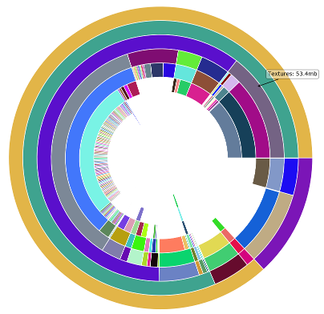

# memreport-tool
This tool aims to visualize UE4 memreport file content. 

Current status: displaying texture or sound size information in form of nested donut chart.

### Sample chart

### Dependencies

Application was created with Python 3.6.

Required packages:

- `anytree`
- `matplotlib`

### Usage
Call `main.py` with parameters:
- `-i <input_filename>` - obligatory: memreport file 
- `-c <chart_type>` - obligatory: chart type, one of the following: [`textures`, `sounds`]
- `-t <size threshold in KB>` - optional: hides items under certain size
